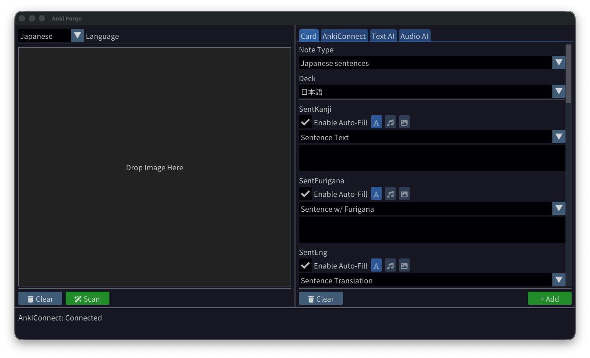
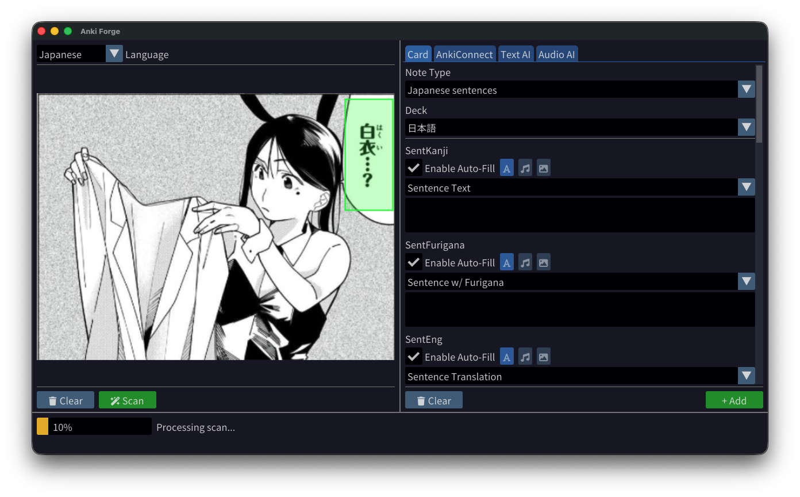
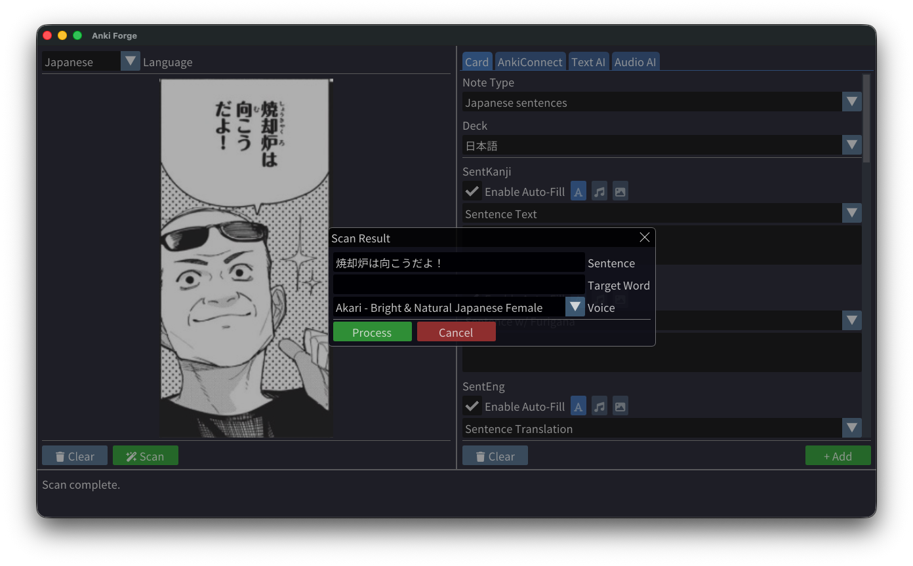
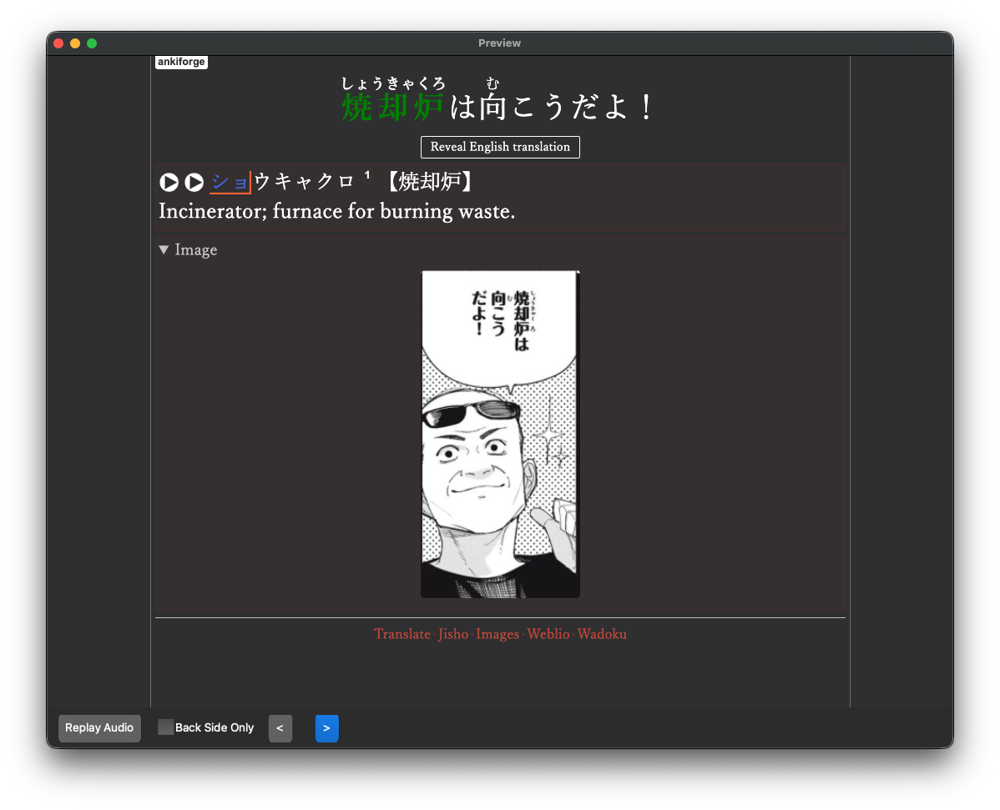
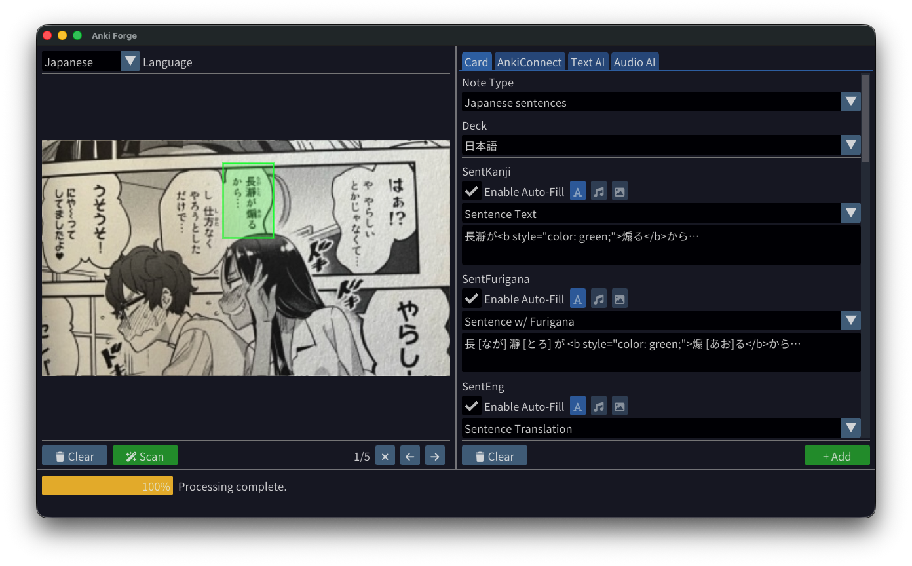

# Anki Image2Card

Anki Image2Card is a modern C++23 cross-platform desktop application designed to streamline the process of creating high-quality Anki cards from images. It leverages modern AI technologies for OCR, text analysis, and audio generation to automate the card creation workflow.

## Features

- **Modern C++23**: Built with C++ standards for performance and type safety.
- **Cross-Platform**: Runs on macOS, Windows, and Linux.
- **Beautiful UI**: Built with SDL3 and Dear ImGui for a responsive and intuitive interface.
- **Image Processing**: Drag and drop images, crop sections for analysis.
- **AI Integration**:
  - **Text AI**: Integration with Gemini (Google) and xAI (Grok) for OCR and sentence analysis.
  - **Audio AI**: Integration with ElevenLabs for high-quality text-to-speech.
- **Local OCR**: Built-in Tesseract OCR support for offline, fast text extraction with configurable text orientation (horizontal/vertical).
- **Anki Integration**: Connects directly to Anki via AnkiConnect to create cards automatically.
- **Smart Fields**: Automatically detects and fills fields like Sentence, Translation, Target Word, Furigana, Pitch Accent, and Definitions.

## Screenshots











## Prerequisites

- **C++ Compiler**: A C++23 compatible compiler (Clang 17+, GCC 13+, MSVC 2022+).
- **CMake**: Version 3.25 or higher.
- **Git**: For fetching dependencies.
- **Tesseract OCR**: Required for local OCR functionality.
  - **macOS**: `brew install tesseract`
  - **Linux**: `sudo apt-get install tesseract-ocr libtesseract-dev` (Ubuntu/Debian) or equivalent
  - **Windows**: Download from [UB Mannheim](https://github.com/UB-Mannheim/tesseract/wiki)
- **Anki**: With the [AnkiConnect](https://ankiweb.net/shared/info/2055492159) add-on installed.

## Building

This project uses CMake and FetchContent to manage dependencies (SDL3, ImGui, nlohmann/json, cpp-httplib).

1. **Clone the repository**:

   ```bash
   git clone https://github.com/DaveMcMartin/anki-image2card.git
   cd anki-image2card
   ```

2. **Create a build directory**:

   ```bash
   mkdir build
   cd build
   ```

3. **Configure the project**:

   ```bash
   cmake ..
   ```

4. **Build**:

   ```bash
   cmake --build .
   ```

5. **Run**:
   - **macOS**: `./bin/Anki\ Image2Card.app/Contents/MacOS/Anki\ Image2Card`
   - **Linux**: `./bin/Anki\ Image2Card`
   - **Windows**: `bin\Anki Image2Card.exe`

## Project Structure

- `src/` - Main application source code
  - `core/` - Core functionality
  - `ui/` - User interface components
  - `ai/` - AI integration modules
  - `api/` - API clients (AnkiConnect)
  - `audio/` - Audio processing and playback
  - `config/` - Configuration management
  - `language/` - Language utilities
  - `ocr/` - OCR providers (Tesseract)
  - `utils/` - Utility functions
- `cmake/` - CMake build scripts and utilities
- `docs/` - Documentation and screenshots
- `assets/` - Application assets (icons, etc.)
- `tessdata/` - Tesseract language data files

## Usage

1. **Configuration**:
   - Go to the "Configuration" tab.
   - Set up your AnkiConnect URL (default is usually `http://localhost:8765`).
   - Enter your API keys for Text AI providers and Audio AI providers you want to use.
   - On the Card tab, select the Note Type, deck, and fields you want to fill.

2. **OCR Configuration**:
   - Go to the "Configuration" tab and select the "OCR" subtab.
   - Choose between **Tesseract (Local)** or **AI (Cloud-based)** OCR methods.
   - Tesseract is faster, works offline, and is ideal for simple text extraction.
   - AI OCR provides better accuracy for complex layouts and handwriting.

3. **Card Creation**:
   - Drag and drop an image (e.g., a page from a manga or book) into the Image Section.
   - Select the area you want to scan.
   - If using Tesseract, select the text orientation (horizontal or vertical) using the buttons in the Image Section.
   - Click "Scan" to process the image with your configured OCR method.
   - Review the generated fields in the "Anki Card Settings" section.
   - Click "Add" to create the card in Anki.

## FAQ

1. **Why only Google and xAI?**
   If you are mining sentences from manga, you'll find out that many AI providers refuse requests due to content concerns. I initially tried using Grok because it is uncensored, but its OCR is simply horrible, so I had to implement Gemini.

2. **Why ElevenLabs?**
   The best quality per price available, with easy integration for adding other TTS providers.

3. **Which Note Type do you use?**
   The "Japanese Sentence" note type from the Ankidrone Foundation deck.

4. **Can I use other AI/TTS providers?**
   Yes! The architecture is designed to be extensible. You can add new providers by implementing the appropriate interfaces in the `ai/` modules. Feel free to open a pull request if you have implemented a new provider.

## Dependencies

- **SDL3**: Cross-platform graphics and input handling.
- **ImGui**: Immediate-mode GUI framework with docking support.
- **nlohmann/json**: Modern JSON library for C++.
- **cpp-httplib**: Lightweight HTTP client library.
- **Tesseract OCR**: Local optical character recognition.
- **Leptonica**: Image processing library (dependency of Tesseract).

Most dependencies are automatically fetched and built by CMake. Tesseract and Leptonica are found using pkg-config on your system.

## License

This project is licensed under the GNU General Public License v3.0 (GPLv3). See the LICENSE file for details.

## Planned Features

This is a work in progress. Here are some planned features, it is not in priority order:

- [ ] Github Action on release that generates binaries for Windows, macOS, and Linux.
- [x] Add local OCR option with Tesseract with configurable text orientation
- [x] Add support for multiple images
- [ ] Add support for Ollama
- [ ] Give user more control over AI configuration (prompts, etc)
- [ ] Add custom auto-fill fields for the user
- [ ] Add local audio generation
- [ ] Add support for OpenAI
- [ ] Add support for DeepSeek

## Contributing

Contributions are welcome! Please feel free to submit issues and pull requests to improve the project.
