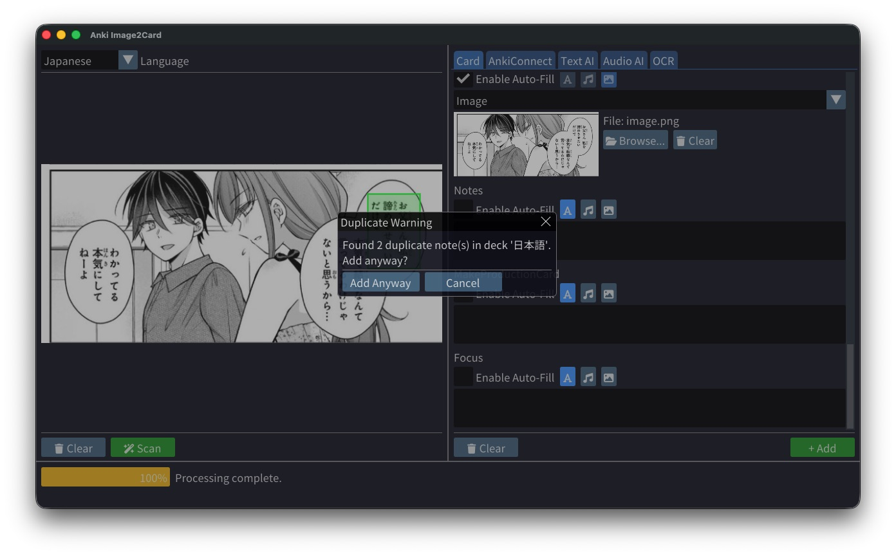
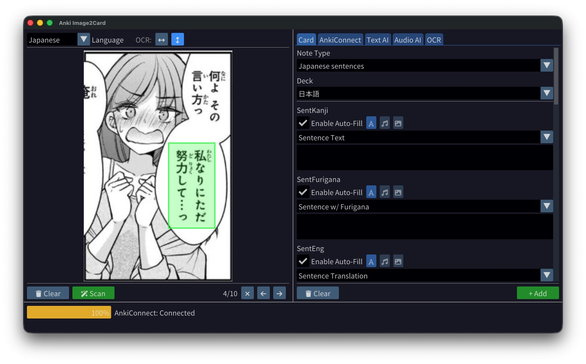
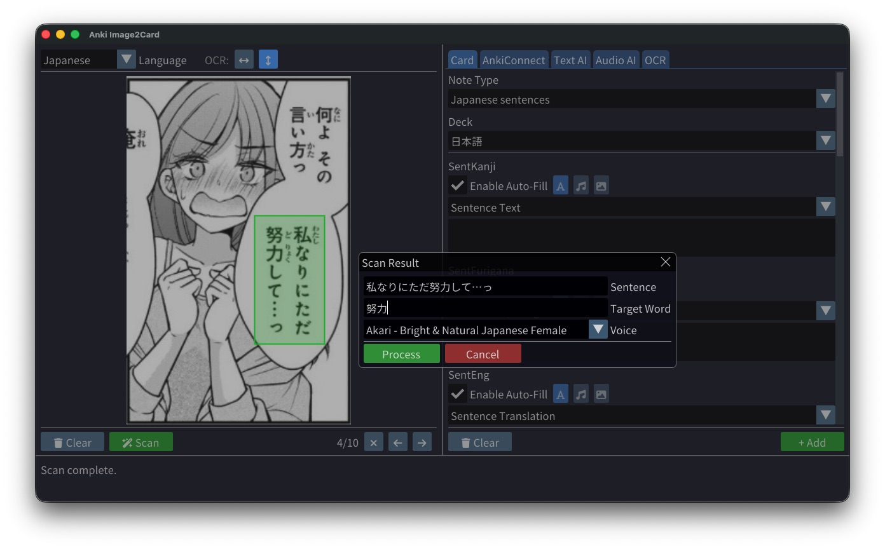
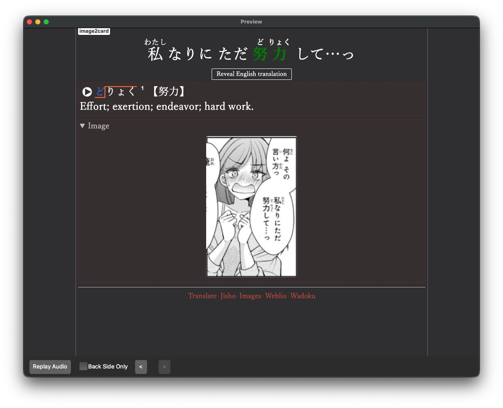

# Anki Image2Card

Anki Image2Card is a modern C++23 cross-platform desktop application designed to streamline the process of creating high-quality Anki cards from images. It leverages modern AI technologies for OCR, text analysis, and audio generation to automate the card creation workflow.

## Features

- **Modern C++23**: Built with C++ standards for performance and type safety.
- **Cross-Platform**: Runs on macOS, Windows, and Linux.
- **Beautiful UI**: Built with SDL3 and Dear ImGui for a responsive and intuitive interface.
- **Image Processing**: Drag and drop images, crop sections for analysis.
- **Local Processing**:
  - **Local OCR**: Multiple OCR options including Native OS (macOS Vision Framework, Windows Media OCR), Tesseract (offline), and AI (cloud-based).
  - **Native OCR**: Built-in OS integration for fast, accurate text extraction (Vision framework on macOS, Windows Media OCR on Windows).
  - **Tesseract OCR**: Offline text extraction with configurable text orientation (horizontal/vertical).
  - **Mecab Morphological Analysis**: Local Japanese morphological analysis for accurate word parsing and sentence breakdown.
  - **JMDict Dictionary**: Offline dictionary lookup using SQLite database for word definitions.
  - **Pitch Accent Database**: Local pitch accent lookup for accurate pronunciation patterns.
  - **Forvo Audio**: Integration with Forvo for native speaker audio pronunciation.
- **AI Integration (optional)**:
  - **OCR**: Integration with Gemini (Google) and xAI (Grok).
  - **Translation**: Optional AI-powered sentence translation via Gemini, xAI.
  - **Audio AI**: Integration with ElevenLabs for high-quality text-to-speech (fallback when Forvo is unavailable).
- **Anki Integration**: Connects directly to Anki via AnkiConnect to create cards automatically.
- **Smart Fields**: Automatically detects and fills fields like Sentence, Translation, Target Word, Furigana, Pitch Accent, and Definitions.

## Screenshots









## Prerequisites

- **C++ Compiler**: A C++23 compatible compiler (Clang 17+, GCC 13+, MSVC 2022+).
- **CMake**: Version 3.25 or higher.
- **Git**: For fetching dependencies.
- **Tesseract OCR** (Optional): Required only if you want to use Tesseract for text extraction. Native OS OCR (macOS/Windows) and AI OCR are built-in.
  - **macOS**: `brew install tesseract`
  - **Linux**: `sudo apt-get install tesseract-ocr libtesseract-dev` (Ubuntu/Debian) or equivalent
  - **Windows**: Download from [UB Mannheim](https://github.com/UB-Mannheim/tesseract/wiki)
- **Mecab**: Required for local morphological analysis (Japanese word parsing).
  - **macOS**: `brew install mecab mecab-ipadic`
  - **Linux**: `sudo apt-get install mecab libmecab-dev mecab-ipadic-utf8` (Ubuntu/Debian) or equivalent
  - **Windows**: Download from [GitHub](https://github.com/ikegami-yukino/mecab/releases)
- **Anki**: With the [AnkiConnect](https://ankiweb.net/shared/info/2055492159) add-on installed.

## Building

This project uses CMake and FetchContent to manage dependencies (SDL3, ImGui, nlohmann/json, cpp-httplib).

1. **Clone the repository**:

   ```bash
   git clone https://github.com/DaveMcMartin/anki-image2card.git
   cd anki-image2card
   ```

2. **Create a build directory**:

   ```bash
   mkdir build
   cd build
   ```

3. **Configure the project**:

   ```bash
   cmake ..
   ```

4. **Build**:

   ```bash
   cmake --build .
   ```

5. **Run**:
   - **macOS**: `./bin/Anki\ Image2Card.app/Contents/MacOS/Anki\ Image2Card`
   - **Linux**: `./bin/Anki\ Image2Card`
   - **Windows**: `bin\Anki Image2Card.exe`

## Project Structure

- `src/` - Main application source code
  - `ai/` - AI integration modules (includes platform-specific native TTS)
  - `api/` - API clients (AnkiConnect)
  - `audio/` - Audio processing and playback
  - `config/` - Configuration management
  - `core/` - Core functionality
  - `language/` - Language utilities
  - `ocr/` - OCR providers (Native OS, Tesseract, AI)
  - `ui/` - User interface components
  - `utils/` - Utility functions
- `cmake/` - CMake build scripts and utilities
- `docs/` - Documentation and screenshots
- `assets/` - Application assets (icons, etc.)
- `tessdata/` - Tesseract language data files

## Usage

1. **Configuration**:
   - Open Anki
   - Go to **AnkiConnect** tab and set up your AnkiConnect URL (default is usually `http://localhost:8765`), click connect and select a deck and note type.
   - Go to the **OCR** tab: Choose from Native OS (built-in OS framework: Vision on macOS, Windows Media OCR on Windows), Tesseract (local, offline), or AI (cloud-based, more accurate).
   - Go to the **Dictionary** tab: Select your preferred translation service for word definition and sentence translation.
   - Go to the **Settings** tab: Enter API keys for the services you want to use if any.

### Service Configuration

**Translation Services**:

- **None**: No sentence translation (uses word dictionary only).
- **DeepL**: Cloud-based translation service with high-quality results.
  - Sign up at [https://www.deepl.com/pro-api](https://www.deepl.com/pro-api)
  - Paste your API key in the Settings tab under "DeepL Translation"
  - Choose between Free API (limited requests) or Pro API (unlimited with paid plan)
  - Excellent for natural-sounding translations
- **Google Translate**: Free cloud-based translation service.
  - No API key required - uses public Google Translate endpoint
  - Completely free to use
  - Good for quick translations, though sometimes less natural than DeepL
- **Gemini**: Google's advanced AI model for translation.
  - Get API key at [https://ai.google.dev/](https://ai.google.dev/)
  - Requires Google Cloud account setup
  - Best quality translations but may be slower depending on the selected model
  - Paste API key in the Settings tab
- **xAI**: Grok AI model for translation.
  - Get API key at [https://console.x.ai/](https://console.x.ai/)
  - Provides high-quality translations but may be slower depending on the selected model
  - Paste API key in Settings tab

**Word Dictionary Services**:

- **JMDict**: Built-in offline Japanese dictionary (no API key needed).
- **DeepL**: Uses DeepL API for word lookups (same API key as translation).
- **Google Translate**: Free cloud-based word definitions.
- **Gemini**: AI-powered definitions (same API key as translation).
- **xAI**: AI-powered definitions (same API key as translation).

2. **Card Creation**:
   - Drag and drop an image (e.g., a page from a manga or book) into the Image Section.
   - Select the area you want to scan.
   - If using Tesseract, select the text orientation (horizontal or vertical) using the buttons in the Image Section.
   - Click "Scan" to extract text using your configured OCR method (Native OS, Tesseract, or AI).
   - The app uses **local processing** for:
     - Morphological analysis (Mecab)
     - Word definitions (JMDict)
     - Pitch accent patterns (local database)
     - Furigana generation (Mecab-based)
     - Audio pronunciation (Forvo, with AI fallback)
   - Translation is handled by your selected translation service (or skipped if "None").
   - Review the generated fields in the **Card** tab.
   - Click "Add" to create the card in Anki.

## FAQ

1. **Which Note Type do you use?**
   The "Japanese Sentence" note type from the [Ankidrone Foundation](https://tatsumoto-ren.github.io/blog/jp1k-anki-deck.html) deck.

2. **Can I use other AI/TTS providers?**
   The architecture is designed to be extensible. You can add new providers by implementing the appropriate interfaces in the `ai/` modules. Feel free to open a pull request if you have implemented a new provider.

## Dependencies

- **SDL3**: Cross-platform graphics and input handling.
- **ImGui**: Immediate-mode GUI framework with docking support.
- **nlohmann/json**: Modern JSON library for C++.
- **cpp-httplib**: Lightweight HTTP client library.
- **Tesseract OCR**: Local optical character recognition.
- **Leptonica**: Image processing library (dependency of Tesseract).
- **Mecab**: Japanese morphological analyzer.
- **SQLite3**: Database engine for local dictionaries and pitch accent data.

Most dependencies are automatically fetched and built by CMake. Tesseract, Leptonica, Mecab, and SQLite3 are found using pkg-config on your system.

## License

This project is licensed under the GNU General Public License v3.0 (GPLv3). See the LICENSE file for details.

## Planned Features

This is a work in progress. Here are some planned features, it is not in priority order. My idea is to move everything to local processing, so the app becomes more accessible.

- [ ] Github Action on release that generates binaries for Windows, macOS, and Linux.
- [x] Add local OCR option with Tesseract with configurable text orientation
- [x] Add Native OS OCR (macOS Vision framework, Windows Media OCR)
- [ ] Add Native OCR for Linux (research and implementation)
- [x] Add support for multiple images
- [x] Replace AI dictionary with local JMDict
- [x] Get vocab audio from Forvo (with AI fallback)
- [x] Add Mecab for local morphological analysis
- [x] Add pitch accent database for accurate pronunciation patterns
- [x] Add configurable translation services (DeepL, Google Translate, Gemini, xAI)
- [x] Implement Native OCR for Windows (Windows.Media.Ocr API)

## Contributing

Contributions are welcome! Please feel free to submit issues and pull requests to improve the project.
